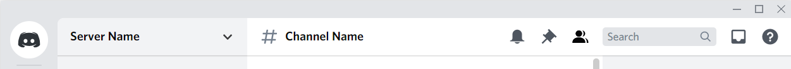
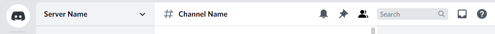

# Discord-plugins-and-themes

Just some things that I've made.

## Custom Avatar Shape
Change avatar and channel masks, any shape from round to square

## Selected Text Color
Highlight and font colors can both be changed in the file

## Remove Top Bar
White channel title area can now be dragged like the top bar used to be able to. Buttons on the right are visible on hover

Before:

After:

