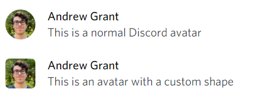
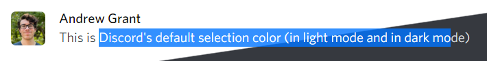
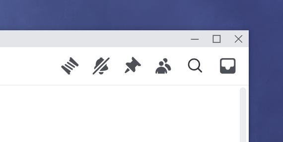
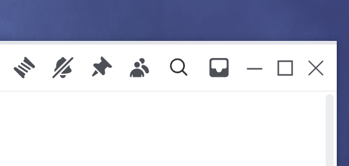
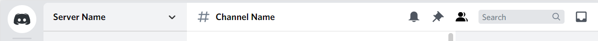

# Discord-plugins-and-themes

Just some things that I've made. All of these should work in conjunction with other themes.

## Custom Avatar Shape
Change the masks of user avatars, channels, the add server button, the public server button, and the Discord logo

## Selected Text Color
Highlight and font colors can both be changed in the file

## Remove Top Bar
White channel title area can now be dragged like the top bar used to be able to. Buttons on the right are visible on hover

Before:

After:

## Remove Help Button
Removes the useless help button (requires "Normalize Classes" to be turned ON in BetterDiscord settings)

