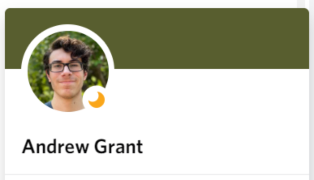
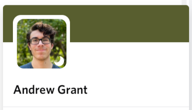
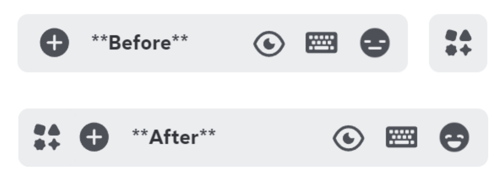
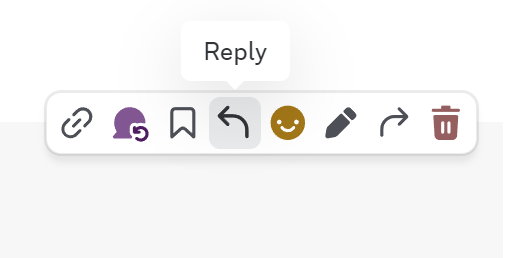
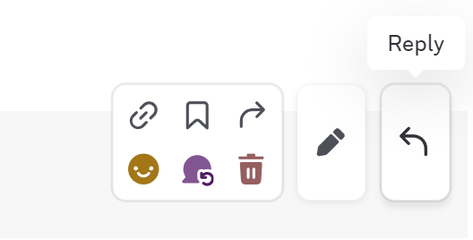
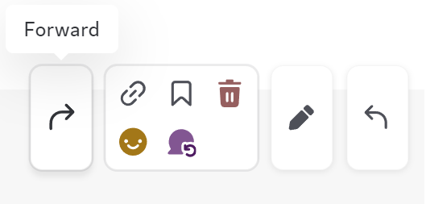

# Discord-plugins-and-themes

Just some things that I've made. All of these should work in conjunction with other themes.

## Custom Avatar Shape
Change the masks of user avatars, channels, the add server button, the public server button, the Discord logo, and more.

Before and after:

 

## Selected Text Color
Highlight and font colors can both be changed in the file

## Remove Top Bar
Windows 10/11 Only.
White channel title area can now be dragged like the top bar used to be able to. Moves minimize, expand, and close window decorations down to align with Discord's title buttons.

Before:

After:

## Attached Channel App Launcher
Moves the App Launcher button and popup to left, and attaches it to the message input bar

## Better Message Buttons

Organizes the message buttons in a grid, with Reply and Edit buttons separated.

Before:

After:

Alternate (also separates "Forward" button):

## Remove Help Button
Removes the useless help button on the right

